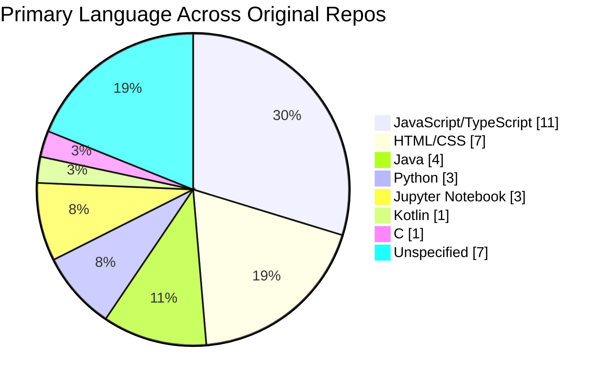

# 👋 Aditya Roshan Dash
### Java & Python Developer — Portfolio Dashboard for Hiring Review
Email me at: adityaroshan1473@gmail.com

*Dashboard generated: 2026-07-09 · Source: GitHub REST API (`/users/adityaroshandash/repos`) · Descriptions verified current*

---

## 🎯 Quick Hiring Snapshot

**Aditya is being positioned for Java Developer / Python Developer roles.** This README works like a
one-page hiring dashboard: pitch and evidence first, full catalog for deeper due-diligence below.

| | |
|---|---|
| 🟢 **Primary stacks demonstrated** | Java (backend/CRUD + DSA fundamentals), Python (automation/scripting) |
| 🟢 **Secondary stack** | Full-stack JavaScript/TypeScript (11 repos) — useful for full-stack Java/Python roles needing frontend collaboration |
| 🟢 **Most recent Java activity** | 2026-07-02 |
| 🟢 **Most recent Python activity** | 2026-07-06 |
| 🟡 **Breadth beyond core stacks** | Machine learning notebooks, cloud deployment (AWS/Django), web/frontend |
| 📁 **Total public repositories** | 44 (37 original, 7 forked/reference) |

> **Reviewer note:** This is a learning-and-building portfolio, not a production SaaS portfolio — several
> repos are labs, coursework, or practice sets. That is normal and expected for early-career Java/Python
> candidates, and the DSA + CRUD + automation repos below are the strongest direct signals for those two
> hiring tracks.

### 🧩 Language Distribution Across Original Projects

### 🛠️ Skill Matrix (Evidence-Based)

| Skill Area | Evidence in Repos | Signal Strength |
|---|---|---|
| **Java — Core & DSA** | `CP` (DSA practice set), `Java-lab`, `tcs_xplore` (enterprise Java mini-project) | 🟢 Practiced |
| **Java — Backend / CRUD** | `CRUD-Application-Midpoint-6` (custom CRUD backend service) | 🟢 Hands-on |
| **Python — Automation / Scripting** | `mehmaan.ai` (automates guest-invitation generation at scale), `python-lab` | 🟢 Hands-on |
| **Python — Applied Project (large scope)** | `project-Redwine` (~188 MB codebase — largest repo in profile) | 🟡 Needs description/README for full context |
| **JavaScript / TypeScript** | 11 repos incl. `movie-booking-system`, `restaurent-booking-system`, `Fraud_detection_Charts` | 🟢 Strong secondary stack |
| **Machine Learning / Data** | `Machine-learning`, `Fraud_detection_Charts`, 2× AICTE/VOIS-sponsored notebooks | 🟡 Coursework-driven, applied |
| **Cloud / DevOps** | `summer-AWS-Django-Cohort` (Django → live on AWS, shell deployment scripts) | 🟡 Exposure, cohort-based |
| **Web / Frontend** | 7 HTML/CSS repos incl. personal portfolio site | 🟢 Practiced |

---

## ☕ Java Project Catalog — *Core Hiring Signal*

Use this section to directly assess Java readiness: DSA fundamentals, a real CRUD backend, and applied
enterprise-style coursework.

| Project | Description | Size | Last Updated |
|---|---|---|---|
| [tcs_xplore](https://github.com/adityaroshandash/tcs_xplore) | mini java project on enterprise java development | 2 KB | 2026-07-02 |
| [CRUD-Application-Midpoint-6](https://github.com/adityaroshandash/CRUD-Application-Midpoint-6) | custom CRUD backend application for Midpoint | 33 KB | 2026-04-28 |
| [CP](https://github.com/adityaroshandash/CP) | All the DSA Practice problems | 19 KB | 2025-08-29 |
| [Java-lab](https://github.com/adityaroshandash/Java-lab) | _No description provided_ | 14 KB | 2023-10-05 |

**What this shows an HR/technical reviewer:**
- `CRUD-Application-Midpoint-6` → can build a backend service with Create/Read/Update/Delete operations, the most common first Java-developer interview/take-home pattern.
- `CP` → actively practices Data Structures & Algorithms in Java, relevant for technical screens.
- `tcs_xplore` → exposure to enterprise-style Java project structure.

---

## 🐍 Python Project Catalog — *Core Hiring Signal*

| Project | Description | Size | Last Updated |
|---|---|---|---|
| [mehmaan.ai](https://github.com/adityaroshandash/mehmaan.ai) | Python project to automate guest invitation at scale | 108 KB | 2026-07-06 |
| [project-Redwine](https://github.com/adityaroshandash/project-Redwine) | _No description provided_ | 192,666 KB | 2024-04-29 |
| [python-lab](https://github.com/adityaroshandash/python-lab) | _No description provided_ | 39 KB | 2024-04-07 |

**What this shows an HR/technical reviewer:**
- `mehmaan.ai` → builds automation tooling in Python (guest-invitation generation "at scale"), a good sign for scripting/automation-focused Python roles.
- `project-Redwine` → by far the largest repo in the profile (~188 MB); worth asking the candidate directly what this project does, since GitHub has no description on file yet.

---

## 🟨 JavaScript / TypeScript Catalog *(Secondary Stack)*

| Project | Description | Size | Last Updated |
|---|---|---|---|
| [DEVservices](https://github.com/adityaroshandash/DEVservices) | Happy hacktoberfest! | 807 KB | 2025-10-28 |
| [Aptitude-calendar-App](https://github.com/adityaroshandash/Aptitude-calendar-App) | provide a date it will find you date on gregorian calendar, using the power of node | 31 KB | 2025-09-25 |
| [Fraud_detection_Charts](https://github.com/adityaroshandash/Fraud_detection_Charts) | Machine learning. How i can visualize ML results | 1,278 KB | 2025-07-26 |
| [chroniclesOfDevelopment](https://github.com/adityaroshandash/chroniclesOfDevelopment) | Yolo | 8 KB | 2025-03-05 |
| [Bharat-Intern-Blog](https://github.com/adityaroshandash/Bharat-Intern-Blog) | A Blog website as an assignment under Bharat intern | 327 KB | 2024-09-30 |
| [template-JS](https://github.com/adityaroshandash/template-JS) | Scaffold your MVC structure, anywhere in few seconds. Available for windows, mac, linux | 1 KB | 2024-05-14 |
| [restaurent-booking-system](https://github.com/adityaroshandash/restaurent-booking-system) | checking out on how react project is made | 144 KB | 2023-12-29 |
| [movie-booking-system](https://github.com/adityaroshandash/movie-booking-system) | Learning project for 3rd semester | 1,746 KB | 2023-12-07 |
| [rookie](https://github.com/adityaroshandash/rookie) | _No description provided_ | 641 KB | 2023-09-26 |
| [Backend-voyage](https://github.com/adityaroshandash/Backend-voyage) | Learn backend using "Hands on" approach | 11 KB | 2023-08-27 |
| [LAB](https://github.com/adityaroshandash/LAB) | ALL MY PROTOTYPE projects | 22 KB | 2023-06-22 |

---

## 🌐 Web / Frontend (HTML & CSS) Catalog

| Project | Description | Size | Last Updated |
|---|---|---|---|
| [adityaroshandash-portfolio](https://github.com/adityaroshandash/adityaroshandash-portfolio) | _No description provided_ | 113 KB | 2026-06-11 |
| [summer-AWS-Django-Cohort](https://github.com/adityaroshandash/summer-AWS-Django-Cohort) | Went from localhost:8000 to live on AWS. Built during a summer cohort using Django, HTML/CSS/JS, and shell scripts for cloud deployment. | 793 KB | 2026-06-08 |
| [Techtonics](https://github.com/adityaroshandash/Techtonics) | _No description provided_ | 9,162 KB | 2025-03-05 |
| [docs.free-form.io](https://github.com/adityaroshandash/docs.free-form.io) | _No description provided_ | 556 KB | 2024-06-27 |
| [Web-dev](https://github.com/adityaroshandash/Web-dev) | A hero with Web, DSA, Machine learning. | 24,040 KB | 2023-09-03 |
| [Damn-O-Web](https://github.com/adityaroshandash/Damn-O-Web) | Thou code shall not work | 188 KB | 2023-08-01 |
| [ARD](https://github.com/adityaroshandash/ARD) | homework | 2 KB | 2023-03-06 |

---

## 📓 Machine Learning / Data Science Catalog

| Project | Description | Size | Last Updated |
|---|---|---|---|
| [VOIS_AICTE_Oct2025_MajorProject_AdityaRoshanDash](https://github.com/adityaroshandash/VOIS_AICTE_Oct2025_MajorProject_AdityaRoshanDash) | _No description provided_ | 3,560 KB | 2025-10-20 |
| [VOIS_AICTE_Oct2025_AdityaRoshanDash](https://github.com/adityaroshandash/VOIS_AICTE_Oct2025_AdityaRoshanDash) | _No description provided_ | 1,446 KB | 2025-09-30 |
| [Machine-learning](https://github.com/adityaroshandash/Machine-learning) | Journey of Machine learning | 22 KB | 2024-02-07 |

---

🔧 Other Languages (Kotlin, C) — click to expand

| Project | Description | Size | Last Updated |
|---|---|---|---|
| [Android-Development](https://github.com/adityaroshandash/Android-Development) | Learning | 47,703 KB | 2025-04-27 |
| [ccollections](https://github.com/adityaroshandash/ccollections) | _No description provided_ | 7 KB | 2024-07-19 |

📁 Misc / Configuration Repositories (no primary language) — click to expand

| Project | Description | Size | Last Updated |
|---|---|---|---|
| [adityaroshandash](https://github.com/adityaroshandash/adityaroshandash) | _No description provided_ | 0 KB | 2026-07-09 |
| [DSA-notes](https://github.com/adityaroshandash/DSA-notes) | _No description provided_ | 1 KB | 2026-06-15 |
| [Anywhere-Files](https://github.com/adityaroshandash/Anywhere-Files) | _No description provided_ | 0 KB | 2026-05-30 |
| [project-Martini](https://github.com/adityaroshandash/project-Martini) | Booking system made by Drunken Masters | 588 KB | 2024-07-06 |
| [where-are-my-readmes](https://github.com/adityaroshandash/where-are-my-readmes) | This contain notes for everything I learn | 0 KB | 2024-05-15 |
| [dot](https://github.com/adityaroshandash/dot) | config Files | 16 KB | 2023-12-20 |
| [private-DNS](https://github.com/adityaroshandash/private-DNS) | _No description provided_ | 8 KB | 2023-10-22 |

🍴 Forked / Contribution Repositories — click to expand

*Shows exposure to external codebases, not original authorship.*

| Project | Description | Size | Last Updated |
|---|---|---|---|
| [NOTE_MAKER_upstream](https://github.com/adityaroshandash/NOTE_MAKER_upstream) | _No description provided_ | 17,816 KB | 2026-02-12 |
| [librosa-forked](https://github.com/adityaroshandash/librosa-forked) | Python library for audio and music analysis | 32,675 KB | 2025-03-21 |
| [url-shortner](https://github.com/adityaroshandash/url-shortner) | _No description provided_ | 83 KB | 2024-08-24 |
| [DSA](https://github.com/adityaroshandash/DSA) | DSA Repo | 70 KB | 2024-08-18 |
| [express-hello-world](https://github.com/adityaroshandash/express-hello-world) | Implements the Expressjs Hello World example to provide a faster start deploying on the Cyclic platform | 204 KB | 2024-02-19 |
| [observability-best-practices](https://github.com/adityaroshandash/observability-best-practices) | Observability best practices on AWS | 49,174 KB | 2023-10-14 |
| [Astro8-Computer](https://github.com/adityaroshandash/Astro8-Computer) | 16-bit homebrew CPU | 188,769 KB | 2023-03-06 |

---

## ℹ️ How to Read This Dashboard

- **Size** is GitHub's reported repo size (KB) — a rough proxy for scope, not quality.
- **Last Updated** is the most recent push date — use it to judge recency of hands-on practice.
- Repos without a description are simply missing a GitHub description field, not necessarily low quality.
- This dashboard only reflects **public** repositories; private/employer work is not visible here.
- For live, always-current data: [github.com/adityaroshandash](https://github.com/adityaroshandash?tab=repositories)

